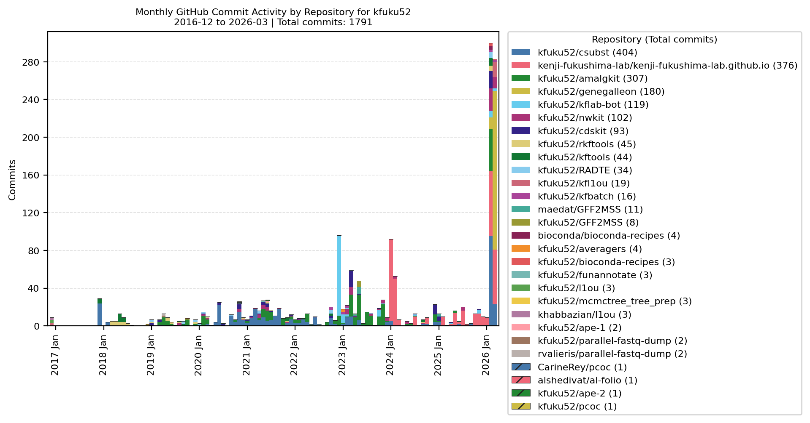
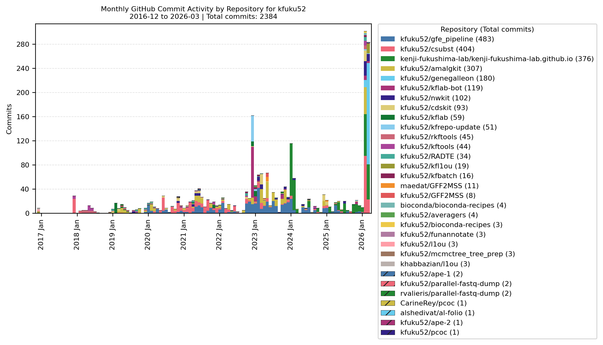

# github_activity_chart

A CLI tool that plots monthly GitHub commit counts as a stacked bar chart split by repository.

## Installation

```bash
python3 -m venv .venv
source .venv/bin/activate
pip install "git+https://github.com/kfuku52/github_activity_chart.git"
```

Use one of the following authentication methods:

- Set `GITHUB_TOKEN` or `GH_TOKEN`
- Use GitHub CLI authenticated with `gh auth login`

## Usage

Generate a PDF from the first detected commit month to the current month:

```bash
github-activity-chart octocat --output output/octocat_monthly_commits.pdf
```

Include private repositories:

```bash
github-activity-chart octocat --include-private --output output/octocat_with_private.pdf
```

Specify a custom range:

```bash
github-activity-chart octocat --from 2025-01 --to 2025-12 --output output/octocat_2025.pdf
```

Limit the number of displayed repositories:

```bash
github-activity-chart octocat --top-repos 10 --output output/octocat_top10.pdf
```

## Example

Example output for `kfuku52` without private repositories:

```bash
github-activity-chart kfuku52 --output output/kfuku52_all_months.png
```



Example output for `kfuku52` with private repositories included:

```bash
github-activity-chart kfuku52 --include-private --output output/kfuku52_all_months_with_private.png
```



## Notes

- Repositories owned by the target user are counted directly from the GitHub REST API.
- Repositories owned by other users are supplemented from GitHub contribution-style GraphQL data.
- Direct counting uses commits on the repository default branch that match `author=<username>`.
- `--include-private` includes private repositories that are accessible to the authenticated user.
- When targeting another user's account, private repositories are included only if the authenticated user can access them.
